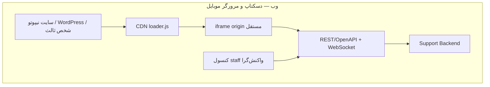

# تحویل و embed

وضعیت: تصمیم معماری قطعی برای نصب. Hosted Widget = همان SPA داخل iframe، نه مسیر نصب جدا. stack UI در [ARCHITECTURE](./ARCHITECTURE.md). REST / NestJS در این سند مقصد **فاز ۴+** است؛ V1 هنوز SupportGateway روی `$app` است.

اپ native (iOS/Android) خارج از این بسته است و مسیر جدا دارد. مرورگر موبایل و کنسول staff واکنش‌گرا داخل محدودهٔ web هستند.

## ۱. جمع‌بندی مدیریتی

- **وب:** Third-Party Widget — CDN `loader.js` کوچک که ویجت را داخل iframe از origin اختصاصی Support می‌گذارد. Web SDK بدون framework؛ host به runtime ویجت دسترسی ندارد. میزبان‌ها: سایت نیپوتو، WordPress، شخص ثالث.
- **WordPress:** plugin نازک برای `widget-id` و تزریق همان loader.
- **مرورگر موبایل:** همان ویجت وب روی Safari / Chrome؛ قید viewport، iframe، cookie و CSP.
- **کنسول staff:** صفحات `staff` واکنش‌گرا روی مرورگر گوشی داخل محدوده است؛ اپ native نیست.
- **API (فاز ۴+):** REST / OpenAPI + WebSocket / AsyncAPI؛ تنها قرارداد رسمی clientهای وب.
- **Backend جدید (فاز ۴+):** NestJS + Fastify به‌صورت modular monolith. اگر سازمان backend بالغ و owner دارد، همان stack بماند و API رسمی آنجا ساخته شود.
- **داده (فاز ۴+):** PostgreSQL، Redis، S3-compatible، BullMQ.

مرز:

1. در هدف، clientها به `$app`، ABR، Vuex، cookie میزبان یا hostname وابسته نمی‌شوند (V1 هنوز Gateway روی `$app` است).
2. `widget-id` عمومی است؛ secret یا token دائمی در snippet / HTML / URL / `localStorage` ممنوع. session بعد از handshake با `setSession` / `SESSION_SET`.
3. Custom Element فقط wrapper اختیاری iframe است. Web Component تزریق UI به DOM / Shadow DOM رد شده.

هدف نصب در React / Vue / WordPress / HTML همین widget / SDK است، نه App Extension و نه export کامپوننت Vue.

در MVP: بدون microservice، Kafka، Kubernetes، OpenSearch، Desktop، Voice.

loader روی هر صفحهٔ وب (دسکتاپ و مرورگر موبایل) کار می‌کند.

## ۲. دیاگرام وب



loader فقط config، lifecycle، open / close، resize و `postMessage` را مدیریت می‌کند. UI، state و business logic داخل iframe می‌مانند. کنسول staff همان وب است (واکنش‌گرا روی دسکتاپ و مرورگر موبایل).

این دیاگرام معماری هدف (فاز ۴+) را نشان می‌دهد. مسیر V1 داخل iframe، `SupportGateway` روی `$app` / ABR است، نه تماس مستقیم با REST/OpenAPI؛ دیاگرام V1 در [ONBOARDING](./ONBOARDING.md) §۴ است.

## ۳. جدول stack هر لایه

| لایه | انتخاب |
| --- | --- |
| Loader | TypeScript بدون runtime dependency؛ esbuild؛ توزیع CDN |
| Widget | SPA مستقل Support (stack در ARCHITECTURE)؛ isolation با iframe + origin جدا + `postMessage` نسخه‌دار |
| WordPress | plugin نازک PHP + `wp_enqueue_script` |
| مرورگر موبایل | همان loader + iframe؛ قید viewport / cookie / CSP |
| کنسول staff | صفحات `staff` واکنش‌گرا روی مرورگر موبایل |
| API (فاز ۴+) | REST / OpenAPI + WebSocket / AsyncAPI |
| Backend (فاز ۴+) | NestJS + Fastify، modular monolith |
| Data / Queue (فاز ۴+) | PostgreSQL + Redis + S3 + BullMQ |
| Auth هدف | OIDC موجود + embed / session token کوتاه‌عمر |
| Operations | Sentry + OpenTelemetry + Grafana + Docker + CI / Terraform |

## ۴. snippet نصب

```html
<script
  src="https://cdn.example.com/widget/v1/loader.js"
  data-widget-id="wid_public_example"
  data-locale="fa-IR"
  async
></script>
```

فقط config عمومی. `widget-id` شناسهٔ tenant / config است، secret نیست. token یا credential دائمی نباید در HTML، URL یا `localStorage` باشد.

loader مسئول نصب، lifecycle، resize و `postMessage` است؛ به محتوای گفتگو دسترسی ندارد.

## ۵. تصمیم هر لایه

### ۵.۱ Loader و distribution

loader کوچک، بدون UI. API: `init`، `open`، `close`، `setSession`، `destroy` + eventهای lifecycle. URL major مثل `/widget/v1/loader.js` برای update سازگار؛ URL دقیق مثل `/widget/1.4.2/loader.js` برای pin. نسخه‌های دقیق immutable و cache طولانی؛ channel قابل update cache کوتاه. iframe version می‌تواند بر اساس `widget-id` canary / rollback شود. loader حداقل با یک protocol version قبلی iframe سازگار می‌ماند.

**SRI:** برای URL نسخهٔ دقیق. روی channel خودکار عملی نیست (تغییر محتوا hash را عوض می‌کند). مشتری بین pin + SRI و update خودکار انتخاب می‌کند. pin امنیت بیشتری می‌دهد اما patch امنیتی را خودکار نمی‌گیرد.

changelog و دورهٔ deprecation برای breaking change لازم است. update ناسازگار loader می‌تواند هم‌زمان همهٔ embedها را بشکند.

### ۵.۲ Hosted Widget

SPA فقط داخل iframe؛ به host نشت نمی‌کند. در فاز ۴+ مستقیماً API رسمی را مصرف می‌کند، نه `$app` یا store میزبان. config مجاز: locale، direction، placement، design token محدود. arbitrary CSS / HTML پذیرفته نمی‌شود. RTL، a11y، focus و keyboard داخل خود widget.

iframe نسبت به تزریق در DOM میزبان theming محدودتری دارد؛ isolation و rollback بهتر است. Shadow DOM این isolation را کامل نمی‌کند و مسیر محصول نیست. CSP سخت‌گیرانه راهنمای نصب و تست برای هر host می‌خواهد؛ wildcard امنیت را ساده‌نما ولی ضعیف می‌کند. تغییر origin ویجت نیازمند config و rollout هماهنگ backend است. حذف اتکا به cookie، endpoint صدور / refresh session می‌خواهد.

### ۵.۳ WordPress

plugin فقط settings، validation و enqueue loader. بدون UI چت، API client یا business logic. تنظیمات: `widget-id` عمومی، locale، placement، فعال / غیرفعال در صفحات. credential authenticated فقط server-side و خارج از HTML. ورودی admin sanitize؛ تغییر config با permission و nonce وردپرس. cache / minify / consent manager و تنوع theme در ماتریس سازگاری. plugin نازک نگه‌داری کمی دارد؛ اکوسیستم وردپرس همچنان تست ماتریسی می‌خواهد.

### ۵.۴ مرورگر موبایل و کنسول staff

همین ویجت وب روی Safari / Chrome موبایل است. قیدها: viewport (`visualViewport`، safe-area)، iframe (ارتفاع، keyboard، `100vh`)، cookie / ITP / third-party storage، CSP و `frame-ancestors`. loader و iframe همان قرارداد دسکتاپ‌اند.

کنسول `staff` باید روی مرورگر گوشی واکنش‌گرا و قابل‌استفاده باشد (فهرست، جزئیات، convey — نه فقط reply).

### ۵.۵ API، Realtime و Backend (فاز ۴+)

REST برای command / query؛ WebSocket برای event. OpenAPI و AsyncAPI منبع client و contract test. backend مالک authorization، idempotency، audit و ترتیب رویداد. WebSocket فقط وقتی سند فعال است؛ adapter ABR پشت API؛ clientها آن را نمی‌بینند.

ماژول‌های سرویس جدید در یک deploy: Conversation، Message، Assignment، Knowledge، File، Notification، Audit. modular monolith شروع و عملیات ساده‌تری دارد. استخراج microservice فقط با bottleneck یا ownership مستقل.

### ۵.۶ Data، File و Search (فاز ۴+)

PostgreSQL منبع حقیقت message / conversation / assignment / audit. Redis: presence، rate limit، cache کوتاه، fan-out. BullMQ: scan، thumbnail. فایل با presigned URL به storage خصوصی؛ type / size / scan سمت سرور. Search با PostgreSQL و `pg_trgm`؛ OpenSearch فقط پس از benchmark فارسی و بار واقعی.

### ۵.۷ Auth و امنیت embedding

anonymous session و authenticated embed token کوتاه‌عمر و scoped. برای کاربر لاگین‌شده، token ترجیحاً server-to-server صادر و بعد از handshake به iframe — این هدف فاز ۴+ است؛ در V1 همان کوکی موجود طبق [ARCHITECTURE](./ARCHITECTURE.md) §۷ استفاده می‌شود و `SESSION_SET` فقط generation را bump می‌کند، نه issuance توکن جدید. معماری هدف به third-party cookie وابسته نیست. `postMessage` با `targetOrigin` دقیق، بررسی `origin` / `source` و schema. `widget-id` به tenant و domain allowlist وصل است.

host: CDN در `script-src`، widget origin در `frame-src`. widget: `frame-ancestors` فقط domainهای مجاز. `X-Frame-Options: SAMEORIGIN` با embed میان‌دامنه‌ای سازگار نیست. CORS فقط originهای لازم؛ wildcard جای authorization را نمی‌گیرد.

iframe sandbox حداقلی (`allow-scripts allow-forms allow-same-origin` فقط روی origin جدا). `allow-top-navigation`، popup و دسترسی اضافه پیش‌فرض خاموش. اگر `allow-same-origin` برای session / API لازم است، iframe حتماً origin جدا از host باشد. notification، navigation خارجی و download حساس از host policy.

Storage Access API fallback اختیاری است؛ پایهٔ login نیست.

### ۵.۸ Observability، CI و Testing

Sentry برای loader / widget؛ OpenTelemetry برای backend. dashboard: load failure، session failure، message delivery، WebSocket reconnect، upload. CI: lint، type-check، unit، contract، E2E، build، security scan. تست سازگاری: WordPress، CSP سخت، Safari (دسکتاپ و موبایل)، third-party cookie blocked، RTL، کنسول staff روی viewport موبایل. deploy: Docker + Terraform روی سرویس مدیریت‌شده.

## ۶. Custom Element و مسیرهای client

| مسیر | کاربرد | مزیت | محدودیت |
| --- | --- | --- | --- |
| Third-Party Widget (iframe + loader / SDK) | وب عمومی، WordPress، هر میزبان | isolation و rollout مرکزی؛ بدون runtime اپ در host | theming / DOM محدودتر |
| Custom Element | ergonomics روی همان iframe | همان isolation؛ API element | UI وارد DOM / Shadow DOM نمی‌شود |

`<nipoto-support-module>` پوستهٔ اختیاری همان iframe است (اولویت ۲)، نه مسیر تحویل جدا.

## ۷. MVP / رشد / مقیاس + roadmap

**MVP:** loader + iframe؛ plugin وردپرس؛ API رسمی و modular monolith (فاز ۴+) یا همان قرارداد موجود در V1؛ session کوتاه‌عمر، domain allowlist، `postMessage` امن؛ پوشش مرورگر موبایل و کنسول staff واکنش‌گرا؛ PostgreSQL / Redis / BullMQ / S3 وقتی سرویس جدید ساخته شود. بدون microservice، Kafka، Kubernetes، OpenSearch، Desktop، Voice.

**رشد:** canary و version policy کامل؛ autoscaling API / WS / worker.

**مقیاس:** جداسازی realtime / notification worker پس از bottleneck؛ Kafka فقط با چند مصرف‌کننده مستقل یا replay / throughput اثبات‌شده؛ Kubernetes وقتی تعداد سرویس و تیم توجیه کند؛ OpenSearch و multi-region با SLO روشن.

Roadmap: ۱) قرارداد OpenAPI / AsyncAPI، session، domain policy، protocol — ۲) جدا کردن UI و اتصال به API رسمی — ۳) Loader / CDN — ۴) WordPress.

مهاجرت مرحله‌ای است؛ ویجت قدیم تا سبز شدن contract و E2E جدید حذف نمی‌شود.

## ۸. ۱۲ چالش — چک‌لیست

| # | چالش | قاعده |
| --- | --- | --- |
| ۱ | استقلال از framework میزبان | loader فقط iframe؛ UI داخل origin جدا. Shadow DOM مسیر محصول نیست |
| ۲ | iframe isolation و CSP | host: `script-src` CDN + `frame-src` widget. widget: `frame-ancestors` از allowlist. نه `X-Frame-Options: SAMEORIGIN`. sandbox حداقلی |
| ۳ | CORS | درخواست از origin ویجت است. CORS فقط همان + origin مدیریتی |
| ۴ | third-party cookie | معماری هدف وابسته نباشد. ناشناس: session کوتاه‌عمر همان widget / domain. لاگین‌شده (فاز ۴+): token scoped از server میزبان؛ در V1 همان کوکی موجود (ARCHITECTURE §۷). token فقط memory بعد از `SESSION_SET`. Safari موبایل / ITP در ماتریس است |
| ۵ | امنیت `postMessage` | `targetOrigin` دقیق؛ `event.origin` و `event.source`؛ schema و version؛ فقط command محدود (`ready` / `open` / `close` / `resize` / `setLocale` / `setSession`)؛ بدون HTML / selector / URL / JS از message |
| ۶ | tenant و domain allowlist | هر `widget-id` → tenant + config + allowlist. session و `frame-ancestors` از همین policy. wildcard فقط زیردامنهٔ کنترل‌شده با تصمیم صریح. preview موقت policy جدا |
| ۷ | CDN و versioning | loader کوچک و API پایدار. `/v1/` در برابر pin. canary روی `widget-id`. changelog و دورهٔ deprecation. pin + SRI در برابر update خودکار |
| ۸ | theming / RTL / a11y | token تأییدشده یا config سرور؛ نه arbitrary CSS/HTML. iframe مسئول RTL / contrast / keyboard / SR. loader focus را می‌دهد و برمی‌گرداند. resize از message معتبر با min / max |
| ۹ | WordPress | فقط settings + `wp_enqueue_script`. admin sanitize؛ تغییر config با permission و nonce. conflict cache / minify / consent در عیب‌یابی |
| ۱۰ | مرورگر موبایل و staff واکنش‌گرا | viewport، keyboard iframe، cookie / ITP، CSP روی Safari / Chrome موبایل. کنسول staff روی گوشی کامل باشد، نه اپ native |
| ۱۱ | فایل در مرورگر موبایل | input فایل ویجت؛ type / size / scan سمت سرور. HEIC رایج Safari را در محدودیت رسمی ببینید |
| ۱۲ | قرارداد رسمی (فاز ۴+) | REST / OpenAPI + WS / AsyncAPI تنها قرارداد clientهای وب. ABR پشت backend و تدریجی حذف. تا فاز ۴+ همان Gateway روی `$app` |

## ۹. مرز مسئولیت‌ها

| لایه | مسئولیت |
| --- | --- |
| Loader | config عمومی (`widget-id`، `locale`)، ساخت / حذف iframe، open / close / resize / lifecycle، `postMessage` نسخه‌دار، خطای بارگذاری بدون محتوای گفتگو |
| Hosted Widget | UI و flow چت، REST / WS (هدف)، session، پیام، فایل، RTL، a11y |
| Host / WordPress | snippet یا plugin؛ اعلام origin / locale / تنظیمات عمومی؛ در سناریوی لاگین، گرفتن token کوتاه‌عمر از server خود |
| کنسول staff | فهرست Ticket و عملیات روی مرورگر دسکتاپ و موبایل (واکنش‌گرا) |

## ۱۰. تست پذیرش + ریسک + سؤالات باز

حداقل ماتریس:

| محور | پوشش |
| --- | --- |
| مرورگر | Chrome، Firefox، Safari با third-party cookie مسدود |
| مرورگر موبایل | Safari و Chrome به‌عنوان مرورگر؛ viewport، iframe، cookie |
| host | HTML ساده، Vue / React، WordPress |
| امنیت | CSP سخت، domain غیرمجاز |
| a11y | RTL، keyboard، screen reader، focus، resize |
| کنسول staff | فهرست / جزئیات / convey روی viewport موبایل |
| session | reconnect، duplicate event، logout |
| فایل | file picker روی موبایل، شکست upload |
| نسخه | loader قدیمی با iframe جدید، rollback |

ریسک‌ها:

1. CSP یا allowlist اشتباه ویجت را برای مشتری قطع می‌کند
2. token flow نامشخص تیم‌ها را به cookie یا workaround ناامن برمی‌گرداند
3. ناسازگاری loader / iframe بدون protocol version rollout سراسری را می‌شکند
4. کنسول staff اگر فقط دسکتاپ فرض شود روی viewport / keyboard موبایل ناقص می‌ماند
5. انتخاب NestJS بدون owner، از توسعهٔ API در backend بالغ موجود پرریسک‌تر است

سؤالات باز تحویل:

1. tenantها domain را چگونه ثبت و تأیید می‌کنند؟
2. anonymous session و authenticated embed token دقیقاً کجا صادر می‌شوند؟
3. سیاست نسخهٔ پیش‌فرض: major channel یا pinned + SRI؟
4. sandbox و Permission Policy دقیق iframe چه قابلیت‌هایی را مجاز می‌کنند؟

## پیوست — منابع MDN / WP

- [امنیت `postMessage`](https://developer.mozilla.org/en-US/docs/Web/API/Window/postMessage)
- [CSP `frame-ancestors` / `frame-src`](https://developer.mozilla.org/en-US/docs/Web/HTTP/Reference/Headers/Content-Security-Policy/frame-ancestors)
- [Storage Access API](https://developer.mozilla.org/en-US/docs/Web/API/Storage_Access_API)
- [Subresource Integrity](https://developer.mozilla.org/en-US/docs/Web/Security/Defenses/Subresource_Integrity)
- [WordPress: Enqueuing Scripts](https://developer.wordpress.org/plugins/javascript/enqueuing/)
