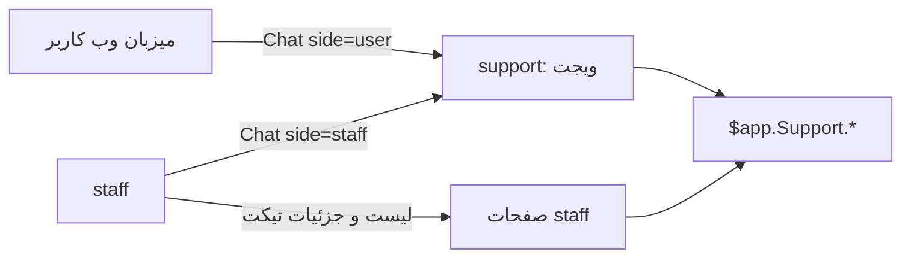
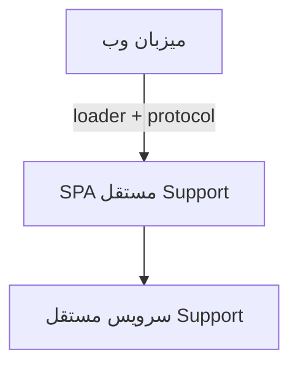

# راهنمای سریع Support

جزئیات فیچر، protocol، embed و B1–B8 در چهار سند بعدی است.

## ۱. امروز چیست / هدف چیست

| | امروز | هدف |
| --- | --- | --- |
| شکل محصول | Quasar App Extension داخل میزبان (`@nipoto/quasar-app-extension-chat`) | ریپوی مستقل + سرویس Support مستقل |
| وابستگی | `this.$app` میزبان، Vuex، store و utility میزبان | بدون وابستگی به پروژه‌های دیگر |
| نصب در اپ دیگر | embed همین extension | Third-Party Widget (`loader.js` + iframe + Web SDK) |
| دامنه | Chat و Ticket فیچر داخلی؛ Ticket = همان `Support.Chat` | همان مدل؛ API جدا به نام Ticket وجود ندارد |

این ریپو محصول کامل پشتیبانی نیست. امروز ویجت چت قابل‌نصب است. کنسول Ticket در ریپوی `staff` است.

## ۲. دو لایه محصول

| لایه | ریپو | نقش |
| --- | --- | --- |
| ویجت مشترک | همین `support` | لانچر شناور، شروع گفتگو، FAQ، صف، پیام، عملیات داخل ویجت |
| کنسول عملیاتی | `staff` | فهرست Ticket، جزئیات، FAQ / Department / Predetermined، availability |

`staff` فقط مصرف‌کننده نیست: ویجت را با `side="staff"` در layout می‌گذارد و صفحه‌های `/support` دارد. نقش‌ها: `supporter`، `supportManager`، `technicalManager`. کنسول staff روی مرورگر موبایل (واکنش‌گرا) داخل محدوده است، نه اپ native.

اپ native (iOS/Android) خارج از این بسته است و مسیر جدا دارد. مرورگر موبایل و کنسول staff واکنش‌گرا داخل محدودهٔ web هستند.

## ۳. مفاهیم

| مفهوم | معنی |
| --- | --- |
| Conversation / Chat | هستهٔ دامنه. open / queue / message / close / convey / processing روی `$app.Support.Chat` و `$app.Support.Message` |
| Ticket | همان `Support.Chat` با وضعیت و metadata بیشتر. `Support.Ticket` و `/api/tickets` وجود ندارد |
| صف (`queued`) | اگر اپراتور در دسترس نباشد گفتگو باز نمی‌شود و در صف می‌ماند |
| حضور (`avail` / `unAvail`) | کارشناس online / offline؛ روی صف و تعداد اپراتور اثر دارد |
| `side` | `user` یا `staff` — فقط نمایش. مجوز از credential و بک‌اند است |
| Department / FAQ / Predetermined | مدیریت در `staff`؛ مصرف در ویجت |

وضعیت‌های UI: `queued`، `processing`، `opened`، `reopened`، `staff replied`، `user replied`، `conveyed`، `requeued`، `closed`.

## ۴. معماری هدف

مقصد: ریپوی جدا + سرویس Support جدا، بدون وابستگی به `staff` یا `$app` میزبان. وب: CDN `loader.js` → iframe از origin جدا → Web SDK بدون framework. UI داخل DOM یا Shadow DOM میزبان bundle نمی‌شود. ارتباط فقط protocol نسخه‌دار؛ میزبان فرمان دامنه مثل `SEND_MESSAGE` نمی‌فرستد. `widget-id` عمومی است؛ توکن بعد از handshake با `SESSION_SET` می‌آید.

stack هدف و ADR در [ARCHITECTURE](./ARCHITECTURE.md). نصب و CSP در [DELIVERY_AND_EMBED](./DELIVERY_AND_EMBED.md).

## ۵. خط زمانی بک‌اند

جدول کامل فازها در [ARCHITECTURE](./ARCHITECTURE.md) §۱۳ است (منبع واحد؛ اینجا کپی نمی‌شود تا دو نسخه از هم drift نکنند). خلاصه: فاز ۰–۲ فقط SupportGateway روی `$app`؛ فاز ۲–۳ additive روی همان ABR (پیشنهادهای B1–B8)؛ فاز ۴+ کلاینت → REST/OpenAPI سرویس NestJS مستقل، ABR پشت API.

## ۶. کارهایی که الان نباید بکنیم

- `Support.Ticket` یا `/api/tickets` فرضی نسازید؛ Ticket همان Chat است
- UI چت را Web Component داخل DOM / Shadow DOM میزبان bundle نکنید
- به `side` یا نقش اعلامی میزبان برای مجوز اعتماد نکنید
- توکن را در URL / snippet / storage پایدار نگذارید
- تا idempotency بک‌اند معلوم نشده، صف mutation آفلاین نسازید
- WebSocket یا نام رویداد جدید از روی حدس ننویسید
- در فاز ۰–۲ API جدید نسازید

## ۷. سؤالات باز قبل از commit

از روی فرانت قطعی نیست:

1. package و نحوهٔ init / auth واقعی `$app` / ABR چیست؟
2. expiry / refresh / revocation توکن چیست؟
3. `SameSite` / `Domain` / `Secure` / `HttpOnly` کوکی‌های `user-token` / `staff-token` چیست؟
4. CORS / WebSocket Origin / CSP برای origin جدید چیست؟
5. schema / ordering / replay رویدادهای realtime چیست؟
6. آیا open / send / close / convey idempotentاند؟
7. آیا سرور list / filter / convey را enforce می‌کند (B4)؟
8. originهای CDN / widget / API در هر محیط چیست؟

سؤالات معماری عمومی‌تر (حداقل نسخهٔ مرورگر هدف، چند instance هم‌زمان، sink observability و ...) در [ARCHITECTURE](./ARCHITECTURE.md) §۱۴ است؛ این‌جا فقط تکرار نمی‌شوند.

## ۸. بعد از این چه بخوانم؟

1. [PRODUCT_MAP](./PRODUCT_MAP.md) — فیچر، جریان، فیلتر، موجودی کد
2. [ARCHITECTURE](./ARCHITECTURE.md) — protocol، session، ADR، stack
3. [DELIVERY_AND_EMBED](./DELIVERY_AND_EMBED.md) — loader، iframe، CSP، مرورگر موبایل
4. [BACKEND_REQUIREMENTS](./BACKEND_REQUIREMENTS.md) — B1–B8
